## test 1
### 1.1 MobiFall Dataset (Only Subject 2)

| Box Plot | Reconstruction Error |
|----------|---------------------|
| 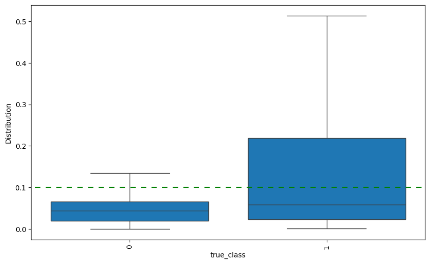 | 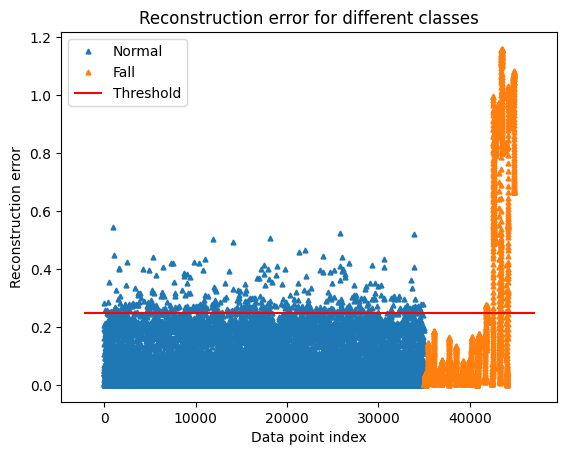 |
| Normal training | Normal training |
| 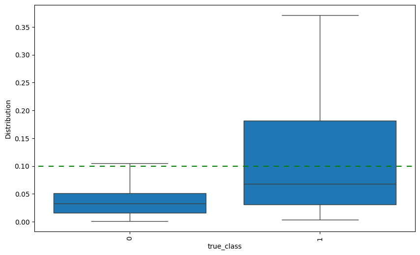 | 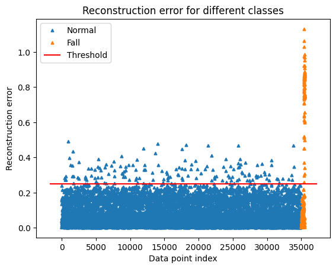 |
| No overlap windows | No overlap windows |

### 1.2 SisFall Dataset (All Subjects)

| Box Plot | Reconstruction Error |
|----------|---------------------|
| 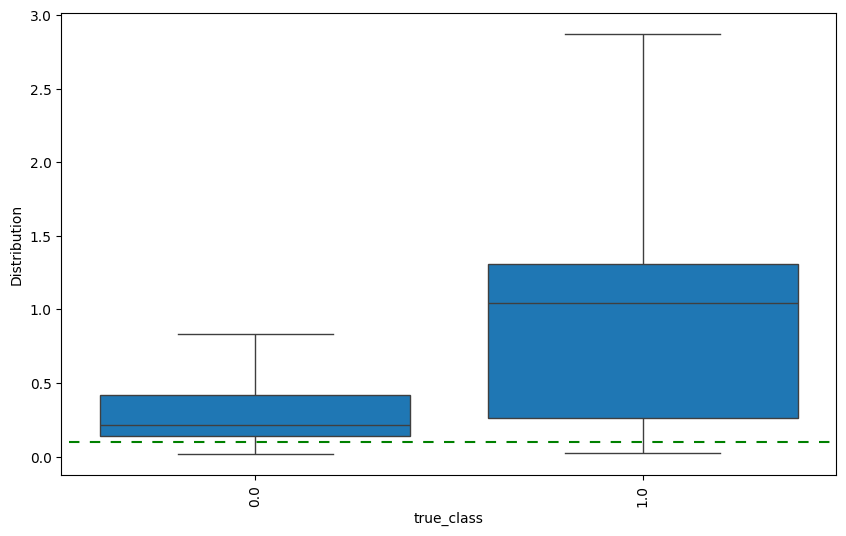 | 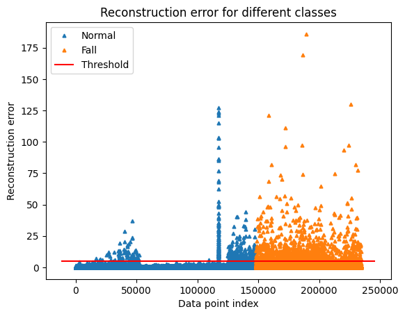 |
| Normal training | Normal training |
| 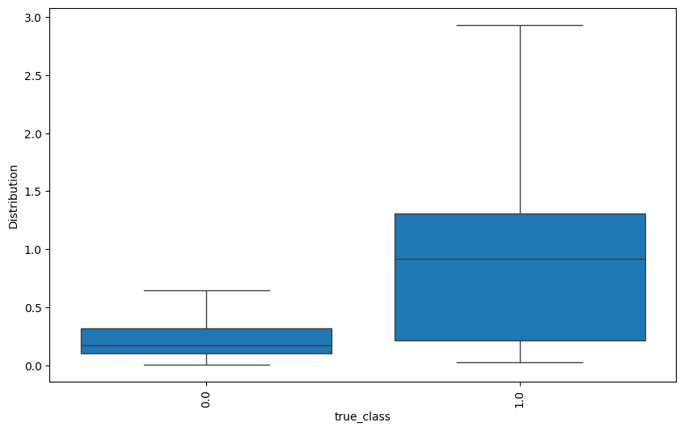 | 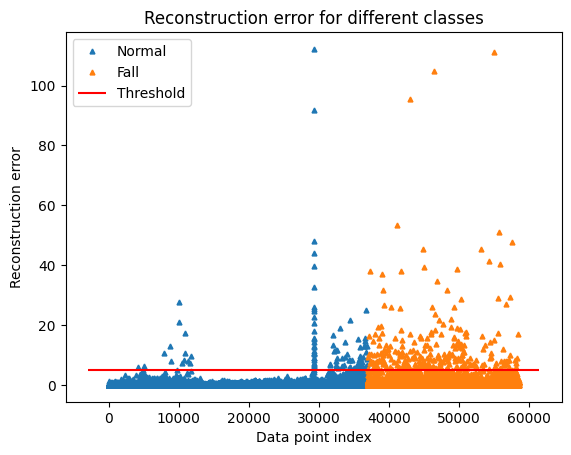 |
| No overlap windows | No overlap windows |

### 1.3 SisFall Dataset (Only Subject SA01)

| Box Plot | Reconstruction Error |
|----------|---------------------|
| 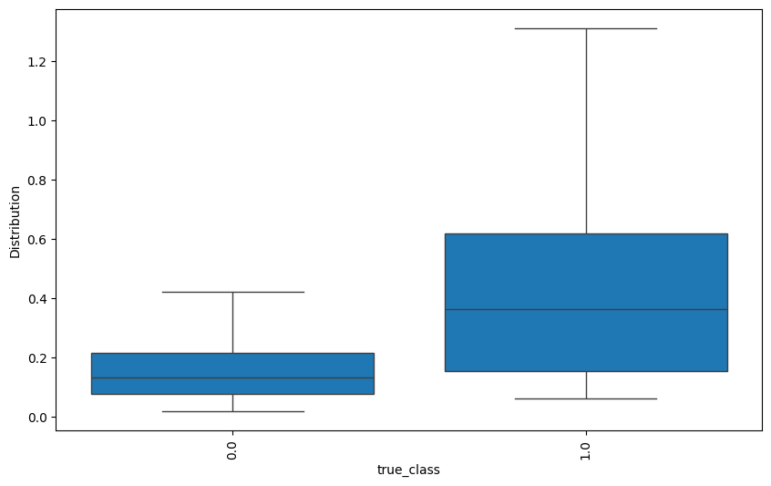 | 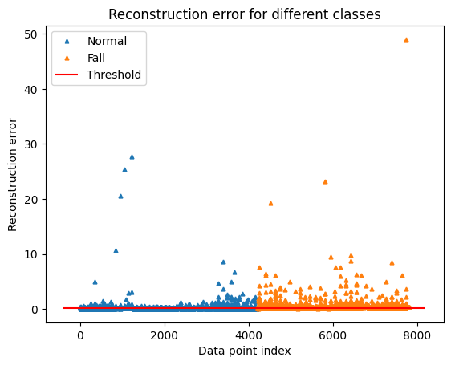 |
| Normal training | Normal training |
| 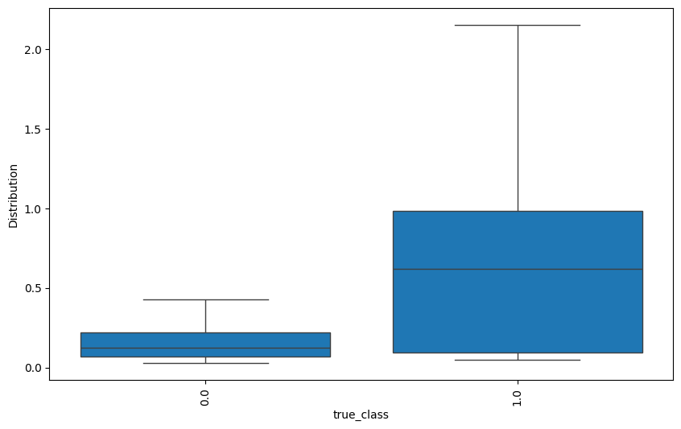 | 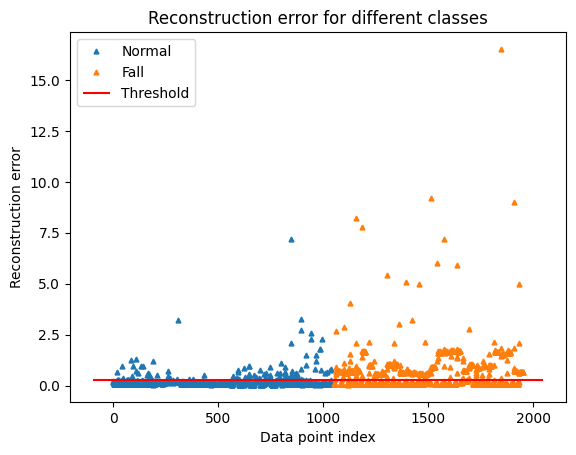 |
| No overlap windows | No overlap windows |
